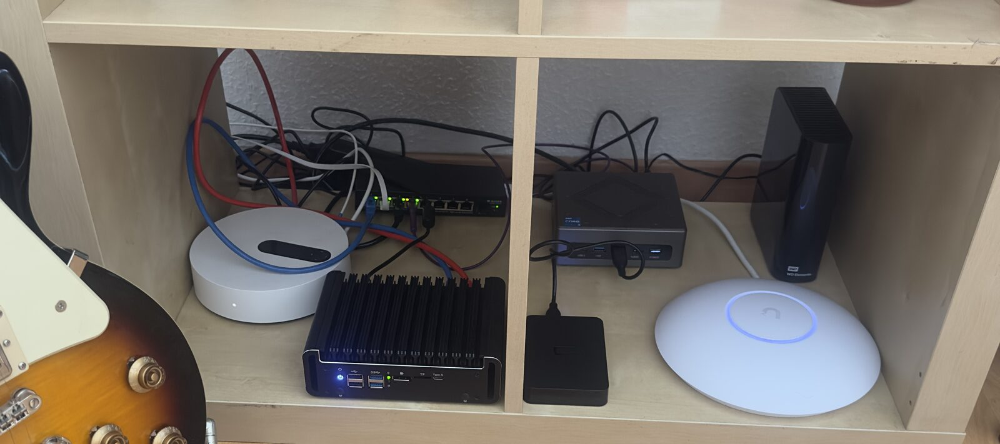
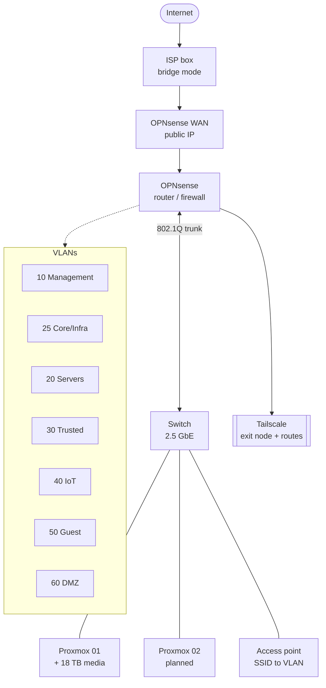

# Homelab

Network design and infrastructure-as-code for a home lab: OpenTofu provisions
the guests, Ansible configures them, OpenBao holds the secrets, Authentik sits
in front of the admin apps, and a segmented network runs underneath.

It was first built by hand, then rebuilt from this code after a full wipe. A
complete replay reports zero changes today.



## What it is

- **Segmented network.** Seven VLANs by role and trust level, deny by default,
  the admin plane isolated from the data plane.
- **Everything in code.** No guest is configured by hand. The one machine whose
  install is manual is the hypervisor itself, and even its operational tooling
  is a role.
- **Real TLS everywhere.** A Let's Encrypt wildcard over DNS-01 with
  split-horizon DNS internally, a private PKI for the infrastructure, remote
  access over Tailscale only.
- **Nothing is published by default.** Anything that needs an inbound path goes
  in the DMZ, behind a second reverse proxy with rules of its own. Everything
  else stops at the network edge.

## Hardware

| Role | Device | Specification |
|------|--------|---------------|
| Router / firewall | Intel N100 mini PC | 8 GB RAM, 250 GB SSD, 4x2.5 GbE (i226-V), OPNsense |
| Hypervisor (node 1) | Nipogi CK10 | i5-12600H, 32 GB, 1 TB NVMe, Proxmox VE |
| Media storage | 18 TB HDD | USB, attached to node 1 |
| Switch | Mokerlink 2.5 GbE | 8x2.5 GbE + 1xSFP+ 10G, managed, 802.1Q |
| Access point | UniFi U7 Pro | WiFi 7, multi-SSID to VLAN, 2.5 G PoE+ injector |
| Hypervisor (node 2) | Minisforum MS-01 *(planned)* | i5-12600H, 64 GB, 2x1 TB NVMe, SFP+ 10 GbE |
| NAS *(planned)* | Jonsbo N3 + N305 board | 8 bays, 4x8 TB ZFS RAIDZ2, 2.5 GbE |

## Stack

### Platform

| | Tool | Role |
|---|------|------|
|  | **Proxmox VE** | Virtualisation. Two independent nodes rather than a cluster |
|  | **OPNsense** | Routing, inter-VLAN firewall, Unbound DNS, Kea DHCP |
|  | **Tailscale** | Remote access: subnet router and exit node |
|  | **OpenTofu** | VM and LXC provisioning, `bpg/proxmox` provider |
|  | **Ansible** | Host and service configuration |
|  | **Nix** | One devshell, same tool versions everywhere |

### Identity, secrets, edge

| | Tool | Role |
|---|------|------|
|  | **OpenBao** | Secrets and the private PKI |
|  | **Authentik** | SSO and identity provider, Traefik forward-auth |
|  | **Traefik** | Reverse proxy, Let's Encrypt wildcard over DNS-01 |
|  | **CrowdSec** | Log-driven banning in front of the public entry point |

### Applications

| | Tool | Role |
|---|------|------|
|  | **Jellyfin** | Media server, iGPU passthrough |
|  | **Seerr** | Request front end |
|      | **\*arr stack** | Radarr, Sonarr, Lidarr, Bazarr, Prowlarr |
|  | **qBittorrent** | Behind a gluetun VPN kill-switch |
|  | **Audiobookshelf** | Audiobooks and podcasts |
|  | **Samba** | SMB shares onto the 18 TB disk |
|  | **Homepage** | Landing page, generated from the proxy's route list |
|  | **Uptime Kuma** | Availability history |
|  | **FreshRSS** | RSS reader, OIDC against Authentik |
|  | **Linkding** | Bookmarks, OIDC against Authentik |
|  | **CouchDB** | obsidian-livesync backend |
|  | **Home Assistant** | Home automation, Matter over Thread |
|  | **UniFi** | Network controller |

### Planned

| | Tool | Role |
|---|------|------|
|  | **k3s / Talos** | Kubernetes on node 2 |
|    | **Observability** | Prometheus, Grafana, Loki |

## Network



`10.10.<vlan>.0/24`, gateway `.1`, static `.2-.99`, DHCP `.100-.199`.

## Documentation

| | |
|---|---|
| [docs/architecture.md](docs/architecture.md) | VLAN plan, firewall matrix, TLS design |
| [docs/services.md](docs/services.md) | Every guest and every route, as they stand |
| [docs/bootstrap.md](docs/bootstrap.md) | From a bare hypervisor to a lab that answers |

## Layout

```
opentofu/   VM and LXC provisioning: a guest catalogue plus three modules
ansible/    configuration: one role per service, one playbook
scripts/    the few things neither tool can do
docs/       architecture, inventory, bootstrap
```

## Getting started

Everything runs from one devshell:

```sh
nix develop                # tofu, ansible, ansible-lint, yamllint, hvac
```

Then fill in the three untracked files that carry the real identifiers, each of
which has a committed `.example` next to it:

```sh
cp opentofu/secrets.auto.tfvars.example        opentofu/secrets.auto.tfvars
cp ansible/inventory/hosts.yml.example         ansible/inventory/hosts.yml
cp ansible/group_vars/all/99-local.yml.example ansible/group_vars/all/99-local.yml
```

Provision, then configure:

```sh
(cd opentofu && tofu init && tofu apply)
(cd ansible && ansible-playbook site.yml)
```

The full path from a bare hypervisor is in [docs/bootstrap.md](docs/bootstrap.md).

The same gates that run in CI run locally:

```sh
(cd opentofu && tofu fmt -check -recursive && tofu init -backend=false && tofu validate)
(cd ansible && ansible-lint) && yamllint --strict .
```

## Secrets

**No secret is committed, not even encrypted.** OpenBao is the single source of
truth, and the bootstrap material that opens it lives outside any working tree,
under `$HOMELAB_SECRETS` (`~/.config/homelab` by default).

There is no permanent root token: one is minted from the unseal keys when a new
secret path has to be created, and revoked in the same breath.

The OpenTofu state holds every input in plaintext, so the backend is local and
untracked. gitleaks runs as a pre-commit hook and again in CI.

## License

MIT. See [LICENSE](LICENSE).
